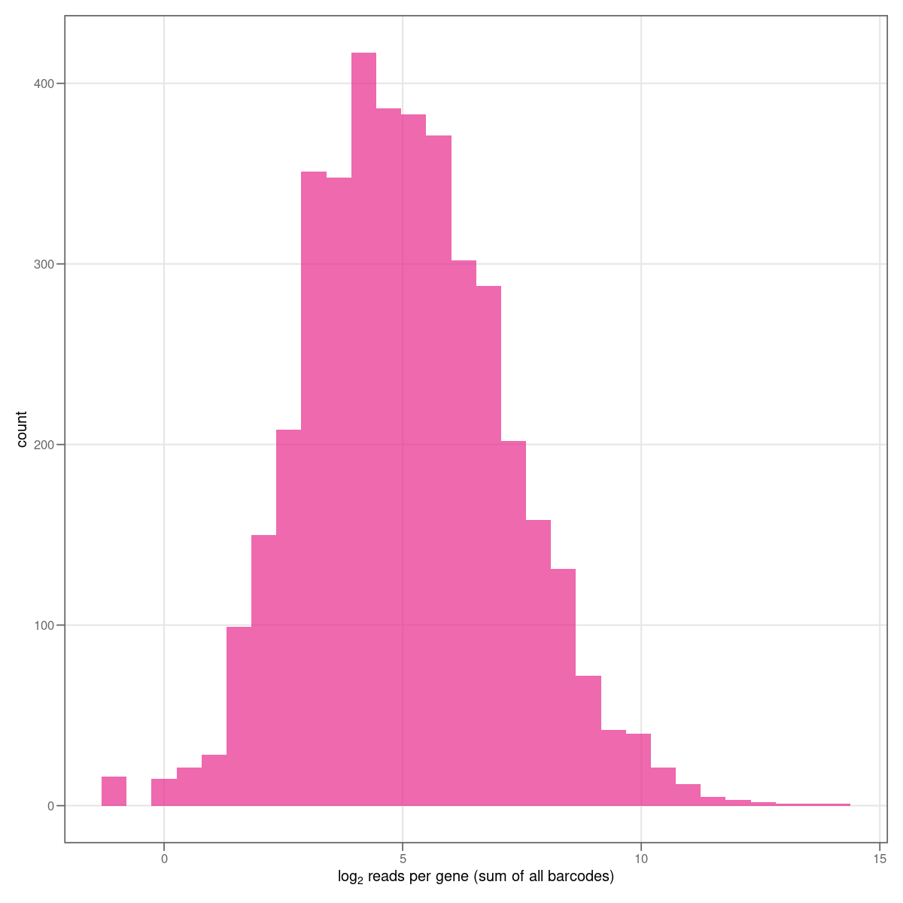

# Pipeline for BarSeq analysis

Pipeline for analysis of Tn-BarSeq data. The pipeline is based on the scripts of [Morgan Price's Feba repository](https://bitbucket.org/berkeleylab/feba/src/master/). The user is referred to the Feba repository or the original Tn-BarSeq publications for further information.

## Usage

The pipeline currently calculates gene fitness values by using a TnSeq knockout genome mapping 'pool file', a 'metadata' file, and gzipped `fastq` files.


### Retrieving data from Illumina basespace *via* command line (optional)

Data in form of `*.fastq` files can be manually downloaded from the basespace website on MacOS or Windows.
For Linux systems, only the command line option is available via Illumina's basespace client `bs-cp`. Files are in Illumina's proprietary format. Execute the following line in a terminal and replace `<your-run-ID>` with the number you will find in the URL of your browser. For example, log in to basespace, navigate to `runs`, select a sequencing run and copy the ID you find in the URL: `https://basespace.illumina.com/run/200872678/details`.

```
bs-cp -v https://basespace.illumina.com/Run/<your-run-ID> /your/target/directory/
```

The data must then be converted to `*.fastq` (plain text) files using Illumina's `bcl2fastq` tool. It is recommended to run it with option `--no-lane-splitting` in order to obtain one file per sample, instead of several files subdivided by lane. If it complains about indices being too similar to demultiplex, the option `--barcode-mismatches 0` can be added.

```
cd /your/target/directory/
bcl2fastq --no-lane-splitting
```

The gzipped `*.fastq.gz` files will be stored in `./Data/Intensities/BaseCalls/`. To merge replicates of the same sample into a new `*.fastq.gz` file, run the following script. The script merges files matching a certain `pattern` into a single new file. Input and output folder can be specified with optional parameters (the default is current directory `./`). New file names are truncated to the part preceding the variable pattern (all characters trailing the pattern are ignored).

- `input_dir` - input directory
- `output_dir` - - output directory
- `file_ext` - file extension of the target files (default: `fastq.gz`)
- `pattern` - all files matching this pattern will be merged (default: `_L00[1-4]_`)

```
source/merge_fastq_files.sh --input_dir data/fastq/ --output_dir data/fastq/ --pattern _R.
```

### Input files

Before starting, a **pool file**, a **metadata** file, and gzipped **`fastq` files** must be prepared.

#### Pool file

The pool file describes TnSeq mappings, and is obtained as output from the [TnSeq pipeline](https://github.com/m-jahn/TnSeq-pipe). It has the following structure. Note that the column for gene IDs is currently named `old_locus_tag`, this can customized if needed. The default location for pool files is `ref/`.

```
barcode  rcbarcode  nTot     n scaffold strand    pos   begin     end gene_strand desc  old_locus_tag new_locus_tag gene_length pos_relative central
CAGAAGA… CCCCGCCC…     1     1 NC_0083… +      1.02e6 1014705 1015328 -           gene  H16_B0896     H16_RS23215           623        0.475 TRUE   
CTGTTGG… ACCAACCC…     1     1 NC_0083… +      3.12e6 3118049 3119266 +           gene  H16_A2889     H16_RS14395          1217        0.411 TRUE   
AGCCGCG… GTCCCCCT…     1     1 NC_0083… -      3.44e6 3442926 3443798 -           gene  H16_A3183     H16_RS15875           872        0.861 TRUE   
CGTCATG… CCACCGCT…     1     1 NC_0083… +      3.46e6 3464096 3464620 -           gene  H16_A3206     H16_RS34325           524        0.960 FALSE  
...
```

#### Metadata file

The tab-separated `metadata.tsv` file contains sample descriptions for the `fastq` files. The `Filename`s must match the names of the supplied files (for our example data, the files in `/data/example/fastq/`).

```
Filename          ID Condition Replicate Date       Time          Reference
01_cond1gen0_1.fast.gz     1 generic           1 2020-12-05 0 TRUE     
02_cond1gen0_2.fast.gz     2 generic           2 2020-12-05 0 TRUE     
03_cond1gen8_1.fast.gz     3 generic           1 2020-12-08 8 FALSE    
04_cond1gen8_2.fast.gz     4 generic           2 2020-12-08 8 FALSE  
```

### Running the analysis

#### Step 1: Extract per-sample barcode counts

This script is a wrapper for the `MultiCodes.pl` script from [FEBA](https://bitbucket.org/berkeleylab/feba/src/master/). It identifies reads containing barcodes and summarizes barcode counts in `.codes` and `.counts` files. It takes the following optional arguments:

- `input_dir` - path to `fastq` files (default `./`)
- `output_dir` (default `./`)
- `pattern` - the file name pattern to look for (default `.fastq.gz`)

To run the script with the example data, execute the following line in the terminal:

```
source/run_MultiCodes.sh --input_dir data/example/fastq --output_dir data/example/counts
```

#### Step 2: Combine BarSeq data and genome mappings

This script is a wrapper for the `combineBarSeq.pl` script from  [FEBA](https://bitbucket.org/berkeleylab/feba/src/master/). It maps barcodes to genomic positions and summarizes results in a single output table (`.poolcount`) and a short report (`.colsum`). It takes the following optional arguments:

- `input_dir` - path to `.counts` and `.codes` files (default `./`)
- `output_dir` (default `./`)
- `poolfile` - path to the pool file (default `./ref/poolfile.tsv`)

```
source/run_combineBarSeq.sh --input_dir data/example/counts --output_dir data/example/results
```

#### Step 3: Calculate gene fitness

This script calculates gene fitness using the method described in [Wetmore 2015](https://mbio.asm.org/content/6/3/e00306-15.full). The script takes the following arguments. All files are saved to the `output_dir` folder.

- `result` - path to the `.poolcount` file from previous step (default: `./data/example/results/result.poolcount`)
- `poolfile` - path to the pool file (default `./ref/poolfile.tsv`)
- `gene_id` - name of the column containing gene IDs in the pool file
- `metadata` - path to the metadata file (default: `./data/example/fastq/metadata.tsv`)
- `output_dir` (default `./`)

```
source/calculate_gene_fitness.sh --result data/example/results/result.poolcount \
  --poolfile ref/poolfile.tsv \
  --gene_id old_locus_tag \
  --metadata data/example/fastq/metadata.tsv \
  --output_dir data/example/results/
```

Expected output are result tables in memory-efficient `.Rdata` format and summary plots in `.png` and `.pdf` format. The two tables are `fitness.Rdata` for all strains (barcodes), including data per gene (columns `Strains_per_gene`, `Norm_fg`, `t`, `Significant`), and `gene_fitness.Rdata` for gene fitness data only (columns `Counts` and `n0` are summed over all strains [barcodes] for each gene, column `log2FC` is log2(`Counts`/`n0`)).

The columns have the following contents:

| Column | Description |
| ------ | ----------- |
| barcode | Barcode sequence |
| locusId | Locus ID (gene name) |
| scaffoldId | Name of DNA molecule |
| Date | Sample date batch; Variable connecting samples to t0 samples |
| Sample | Sample name |
| Condition | Growth condition |
| Counts | Read count for strain (barcode) in sample (summed per gene in gene_fitness table) |
| n0 | Read count in corresponding t0 samples |
| Strains_per_gene | Number of strains (barcodes) for the current locusId |
| Strain_fitness | Strain (barcode) fitness; f_s on p.12 in Wetmore 2015 |
| Norm_fg | Normalized gene fitness; (iii) on p.13 in Wetmore 2015 |
| t | t-like test statistic; calculated on p.13 in Wetmore 2015 |
| Significant | Significant gene if \|t\| > 4; stated on p.3 in Wetmore 2015 |
| log2FC | log2(Counts/n0), only in gene_fitness table |


#### Example of graphical summary

Reads per gene (median of all samples)    |  Barcodes per gene
:-------------------------:|:-------------------------:
  |  

Reads per barcode (by sample)    |  PCA of samples
:-------------------------:|:-------------------------:
  |  


## Authors

Johannes Asplund-Samuelsson, KTH (johannes.asplund.samuelsson@scilifelab.se)

Qi Chen, KTH (qiche@kth.se)

Michael Jahn, KTH (michael.jahn@scilifelab.se)
